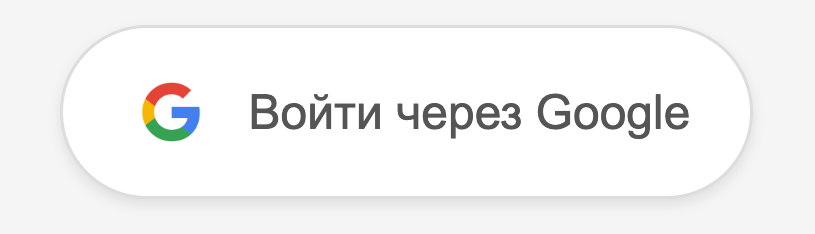

### Описание проекта
Готовое веб-приложение (фронтенд + бэкенд) для получения информации о пользователе через Open ID Connect, и получения прав на ресурсы в Google Календаре и Google Диске.

### Видео
Видео с написанием проекта -> https://www.youtube.com/watch?v=0finVGfKvHU

### Регистрация клиента в Google
1. Зайти на https://console.cloud.google.com/auth/clients
2. Зарегистрировать клиента типа `web-application`, получить client id и client secret

### Запуск бэкенда
0. Если не установлен Python, установить [здесь](http://python.org/)
1. Зайти в директорию /backend
2. Создать виртуальное окружение через `python -m venv venv` и активировать
3. Установить зависимости через `pip install -r requirements.txt`
4. Запустить проект через `uvicorn main:app --reload`

### Запуск фронтенда
0. Если не установлена `node` и `npm`, установить [здесь](https://nodejs.org/en/download)
1. Зайти в директорию /frontend
2. Установить все зависимости `npm install`
3. Запустить проект через `npm run dev` -> откроется на localhost:3000